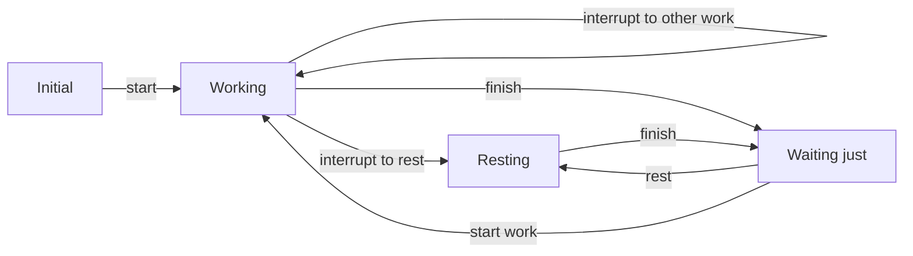

# Flake Nap

## Nap lifecycle

```mermaid
graph LR

init[Initial]
work[Working]
rest[Resting]
wait[Waiting just]

init -- start --> work
work -- interrupt to other work --> work
work -- interrupt to rest --> rest
work -- finish --> wait
wait -- rest --> rest
rest -- finish --> wait
wait -- start work --> work 
```

## TODO

- [ ] Detect continuing work times
